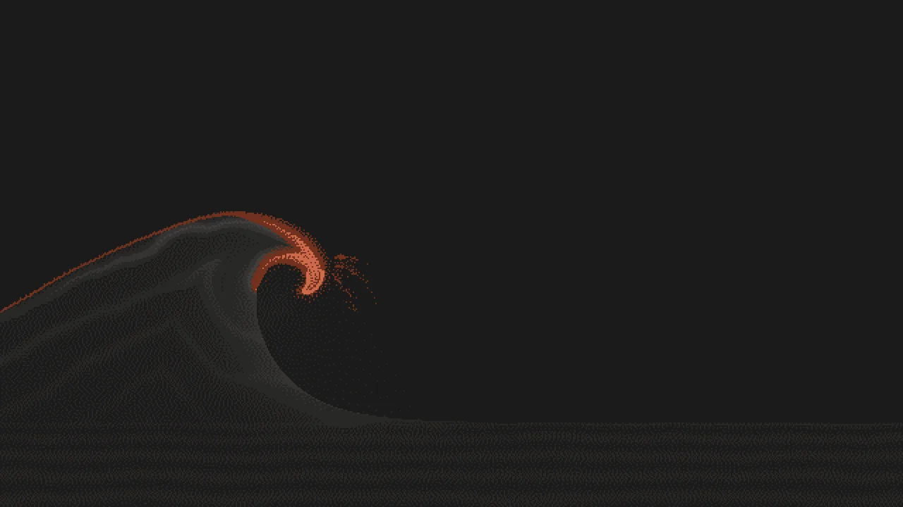

# walldye

Procedural wallpapers, each a small Python script, recolored to any three colors you pick. Browse and download them at [walldye.com](https://walldye.com).

[](https://walldye.com)

## Run it

Needs [uv](https://docs.astral.sh/uv/) and [pnpm](https://pnpm.io/).

```sh
git clone https://github.com/nickolaj-jepsen/walldye && cd walldye
uv run walldye list
uv run walldye render radar-sweep --theme nord --aspect 21:9

uv run walldye build --all   # slow the first time
pnpm install && pnpm dev
```

## NixOS

```nix
# inputs.walldye.url = "github:nickolaj-jepsen/walldye";
wallpaper = inputs.walldye.packages.${pkgs.stdenv.hostPlatform.system}.default.mkWallpaper {
  slug = "radar-sweep";
  theme = "gruvbox-dark"; # or { bg = "#282828"; fg = "#EBDBB2"; accent = "#FE8019"; }
  width = 3440;
  height = 1440;
};
```

`nix run github:nickolaj-jepsen/walldye -- list` lists the slugs.

## Contributing

See [CONTRIBUTING.md](.github/CONTRIBUTING.md).

## License

The code is GPL-3.0-or-later. Each wallpaper has its own license; see [docs/wallpapers.md](docs/wallpapers.md#licensing).
